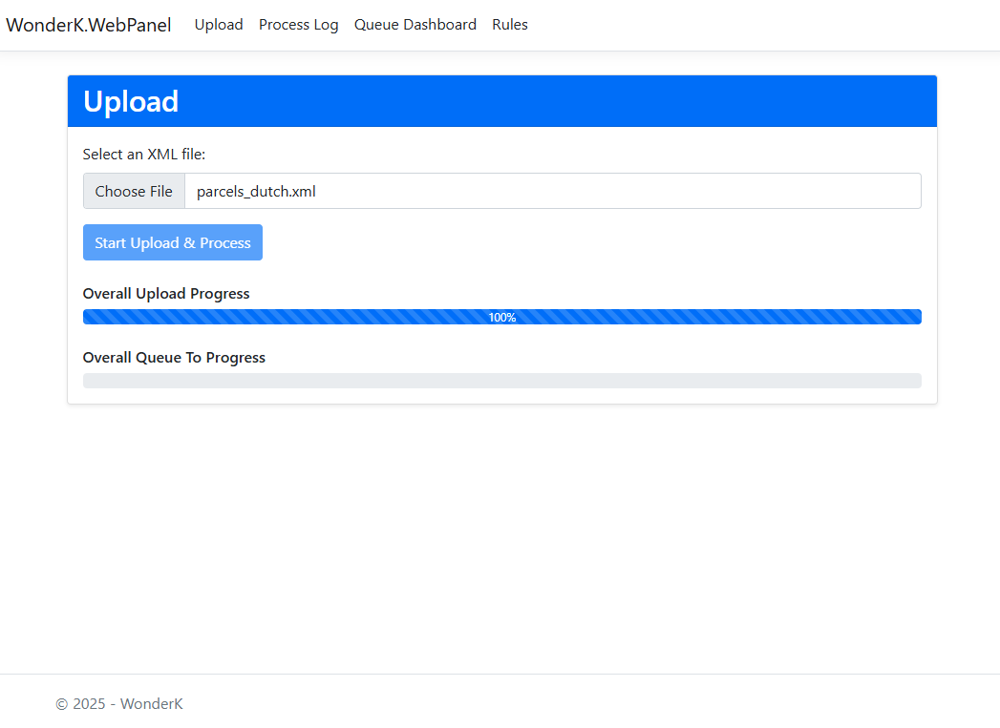
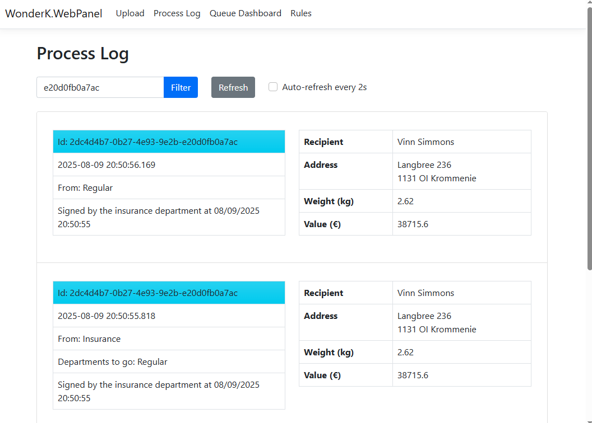
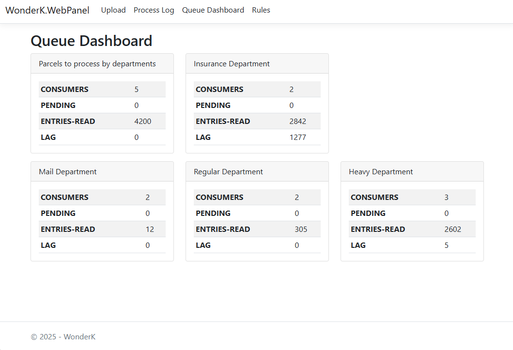
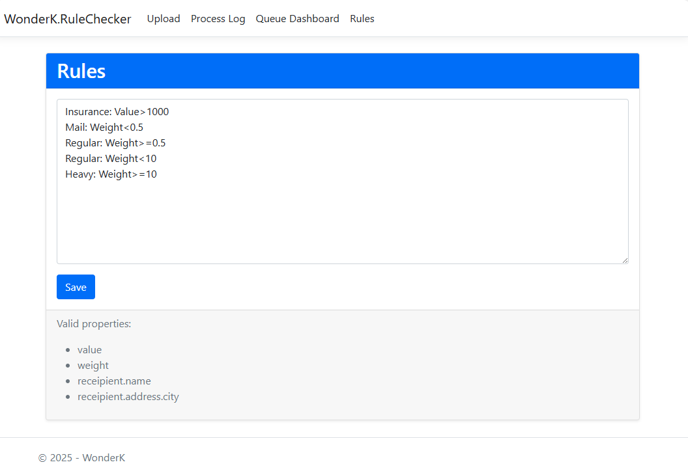
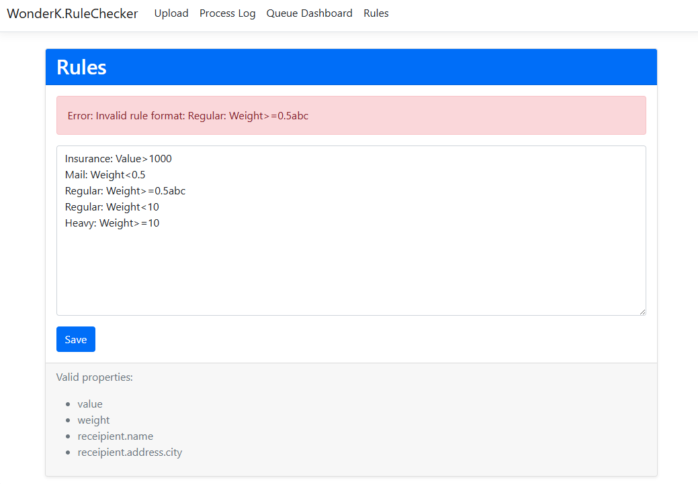
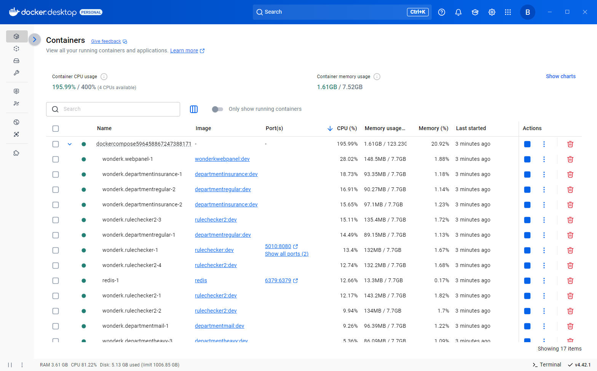

# WonderK
A sample parcel distribution center

You work at a parcel delivery company, and you are asked to design a system to automate the internal handling of parcels coming in. The parcels are coming in at the distribution center and need to be handled by different departments based on their weight and value. Currently, management is making plans that could lead to the addition or removal of departments in the future.

## Features

### Feature 1
The current business rules are as follows:
- Parcels with a weight up to 1 kg are handled by the "Mail" department.
- Parcels with a weight up to 10 kg are handled by the "Regular" department.
- Parcels with a weight over 10 kg are handled by the "Heavy" department.

### Feature 2
Parcels with a value of over € 1000,- need to be signed off by the "Insurance" department,
before being processed by the other departments.

### Feature 3 (optional)
The company has decided to productize the software and sell it under a license
subscription model. The business rules will vary per customer and need to be
configurable.


## System Architecture: A Microservices-Based Parcel Processing System

This architecture uses a **microservices approach** to create a scalable and resilient system for processing parcels. By breaking down the application into smaller, independent services, each part can be developed, deployed, and scaled individually. This design relies on a central **message broker** to enable asynchronous communication between the services, which prevents bottlenecks and ensures that the system can handle high volumes of requests.

The diagram illustrates the following workflow:
The `(xN)` notation indicates that multiple instances of an application can run simultaneously to handle concurrent user uploads.

```
                               +------------------+
 [User with XML File] -------> |  Web Application |
                               |     (xN)         |
                               +------------------+
                                       |
                                       | (Separates parcels into messages)
                                       v
                          +-------------------------+
                          |   [[ parcel-stream ]]   |
                          +-------------------------+ 
                                       | 
                                       | (Reads from queue) 
                                       v 
                               +-----------------+ 
                               |   RuleChecker   | 
                               |      (xN)       | 
                               +-----------------+ 
                                       v 
                                       | (Applies routing rules) 
                                       | 
       +-------------------------------+-----------------------------+--------------------------+
       |                               |                             |                          |
       | If value > 1000               | If weight <= 1 kg           | If 1<w<=10 kg            | If w > 10 kg
       |                               |                             |                          |
       v                               |                             |                          |
+------------------------+             |                             |                          |
| [[ insurance-stream ]] |             |                             |                          |
+------------------------+             |                             |                          |
       |                               |                             |                          |
       | (Consumed by)                 |                             |                          |     
       v                               |                             |                          | 
+----------------------+               |                             |                          | 
| Insurance Department |               |                             |                          |    
|       App (xN)       |               |                             |                          | 
+----------------------+               |                             |                          | 
       v                               |                             |                          |  
       |                               |                             |                          |   
       | (After sign-off,              |                             |                          |
       |  publishes back to streams)   |                             |                          |
       +->-----------------------------+-----------------------------+--------------------------+
                                       |                             |                          |
                                       v                             v                          v 
                        +-----------------------+   +-------------------------+   +-----------------------+
                        |   [[ mail-stream ]]   |   |   [[ regular-stream ]]  |   |  [[ heavy-stream ]]   |
                        +-----------------------+   +-------------------------+   +-----------------------+
                                    |                             |                          |
                                    | (Consumed by)               | (Consumed by)            | (Consumed by)
                                    v                             v                          v
                        +-----------------------+   +-------------------------+   +-----------------------+
                        |    Mail Department    |   |   Regular Department    |   |    Heavy Department   |
                        |        App (xN)       |   |        App (xN)         |   |        App (xN)       |
                        +-----------------------+   +-------------------------+   +-----------------------+
```

1.  **Parcel Ingestion**: The process begins when a user uploads an **XML file** containing parcel data to the **Web Application** (WonderK.WebPanel). This application acts as the entry point to the system. It parses the XML file, extracts the data for each individual parcel, and sends each one as a separate message to a central queue called `parcel-stream`.

2.  **Initial Routing**: The **RuleChecker** (WonderK.RuleChecker) service is the core logic unit of this system. It continuously monitors the `parcel-stream` for new messages. For each parcel it reads, it applies a set of business rules (see: app\WonderK\WonderK.RuleChecker\rules-book.txt) to determine the correct processing path.

      * **High-Value Parcels**: If a parcel's value is over 1000, the RuleChecker first routes it to the `insurance-stream`. This ensures that valuable items receive the necessary sign-off before any further handling.
      * **Weight-Based Routing**: For all other parcels (and for high-value parcels after they have been signed off), the RuleChecker routes them based on weight:
          * Parcels up to **1 kg** go to the `mail-stream`.
          * Parcels between **1 kg and 10 kg** go to the `regular-stream`.
          * Parcels over **10 kg** go to the `heavy-stream`.

3.  **Specialized Processing**:

      * All consumers are in this path: app\WonderK\WonderK.Department.*
      * **Insurance Department**: This service consumes messages from the `insurance-stream`. After an operator signs off on the parcel, the service publishes it back to the appropriate weight-based stream (`mail-stream`, `regular-stream`, or `heavy-stream`) for final processing.
      * **Departmental Services**: The **Mail, Regular, and Heavy Department** applications are the final consumers in the workflow. Each service listens to its dedicated queue (`mail-stream`, `regular-stream`, or `heavy-stream`) and handles the final processing of the parcels assigned to it.

4.  **Parcel Traceability**: To ensure every parcel can be traced throughout its journey in the system, a dedicated logging mechanism is implemented. Each service involved in parcel processing uses a common interface (`IProcessLogger`) defined in `app\WonderK\WonderK.Common\Libraries\IProcessLogger.cs`. This allows consistent logging of parcel events, making it easy to audit and monitor parcel status across all microservices.

This event-driven, microservices-based design ensures that the system is **decoupled and flexible**. For example, if the business rules for routing parcels change, only the **RuleChecker** service needs to be updated. Similarly, if there is a high volume of heavy parcels, more instances of the **Heavy Department** service can be deployed without affecting the other parts of the system.


## Add a new consumer (department)

To add a new consumer (department), follow these steps:

1. **Implement the Consumer Class**: Create a new application for your department and implement the `Consumer` class (see: `app\WonderK\WonderK.Common\Libraries\Consumer.cs`). This class handles consuming messages from a queue.

2. **Register to the Appropriate Queue**: Configure your new consumer to listen to its dedicated queue. This ensures it receives only the parcels intended for its processing.

3. **Update Routing Rules**: Add a rule for your new department in the rule book, specifying the criteria (such as weight or value) and the department name. The RuleChecker will then route parcels matching these criteria to your department’s queue.

**Example:**  
Suppose you want to add a "Security" department to handle parcels with a weight of 5 kg or more. After building the new Security app, update the rule book as follows (assuming the department name is "Security"):

```
Security: Weight>=5
Insurance: Value>1000
Mail: Weight<0.5
Regular: Weight>=0.5
Regular: Weight<10
Heavy: Weight>=10
```

With this rule in place, parcels meeting the criteria will be routed to the Security department for processing.


## Why Redis?

Redis was chosen for this example project to keep things simple. The design uses dependency injection, making it straightforward to swap Redis for other implementations if needed. In real-world scenarios, more robust messaging systems like Kafka or RabbitMQ are often preferred, as they provide advanced features such as durability, scalability, and message delivery guarantees.


## Generating Sample Input XML Files

To generate sample parcel data for testing, use the provided Python script located at `tools\fake-data-generator\main.py`. This script creates realistic XML files containing parcel information. You can adjust the parameters to generate different sizes and types of sample data as needed for development and testing.


## Screenshots

### Upload



This is the upload page where users can submit an XML file containing parcel data. The interface displays the upload progress as the file is chunked and processed, enabling efficient handling of large files without timeouts or browser issues.

### Process Log



This page allows you to view and trace parcels as they move through the system. You can filter the list by parcel information or internal ID, making it easy to locate and monitor specific parcels throughout their processing lifecycle.

### Queue Dashboard



This page displays the status of all parcel queues in the system. You can view the number of consumers attached to each queue, as well as statistics on how many items have been processed or remain pending. This helps monitor throughput and identify any bottlenecks or backlogs in parcel handling.

### Rules





On this page, you can view and edit the rule book directly. The interface highlights any errors encountered while parsing the rules, making it straightforward to identify and correct mistakes.

### Docker



This image is a screenshot from the Docker Desktop application. It illustrates how the project is set up and managed using `docker-compose`, showing the running containers and their statuses as part of the development environment.


## TODO
This project was developed in a short timeframe, so there are a few remaining items that need to be completed to fully realize the intended functionality.

1. It would be beneficial to improve the rule input page by providing more control over user input. Implementing a series of drop-down and input validation would help reduce errors and mistakes, making it easier for users to define rules accurately and consistently.

2. It is possible to extend the rule parsing algorithm to support more advanced logical operators such as **AND**, **OR**, and **NOT**, allowing for the creation of complex, multi-condition rules. Additionally, the system could be enhanced to include more parcel properties in the rule definitions, enabling highly granular and flexible routing logic.

3. To keep this project simple, all RuleChecker instances read from and write to the same `rules-book.txt` file. In a real-world scenario, when the rule book changes, all other instances running on different servers should receive a signal to update themselves with the new changes. Modifications should be managed from a single source of truth to ensure consistency across the distributed system.

4. As a general practice, objects placed in a queue should be as lightweight as possible. In this sample project, the entire `Package` object is currently serialized and sent to the queue, which may not be optimal for performance or scalability. When designing queue messages, consider including only the essential data required for downstream processing. Additionally, the overhead of serialization and deserialization should be taken into account. Large or complex objects can increase latency and resource usage, especially as message volume grows. Optimizing message size and structure helps ensure efficient communication between microservices and improves overall system responsiveness.

5. The application and Docker files can be enhanced to support more flexible configuration, allowing you to set parameters such as the number of items each consumer reads from the queue and the polling interval. This makes it easier to tune performance and behavior for different environments or workloads.
